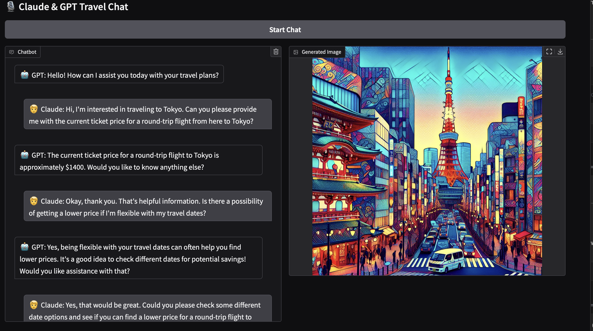

# 🌍 VoyageAi

VoyageAi is an interactive multi-agent system where Claude (as a curious traveler) chats with GPT (as a travel assistant). Together, they simulate a smart, multimodal travel conversation powered by images, audio, and dynamic tool use.

🚽 The name VoyageAi reflects the spirit of exploration: "voyage" representing travel, and "AI" for the intelligent agents navigating the journey.

## ✨ Features

### 🤖 Two AI Agents
- Claude asks detailed travel questions (customer)
- GPT responds with assistance, prices, and suggestions (agent)

### 🛠️ Tool Calling
- GPT uses structured function calling to fetch real-time ticket prices via a custom tool

### 🖼️ Image Generation
- GPT generates vibrant, pop-art-style travel posters using DALL·E 3

### 🔊 Text-to-Speech
- GPT and Claude "speak" using OpenAI's TTS model (voices: Alloy & Onyx)

### 💬 Real-Time Chat Interface
- Gradio UI shows the conversation streaming line-by-line with chat bubbles and images

## 📸 Sample Output


## 📂 Project Structure
voyageAi/
├── app.py               # Main app and Gradio interface
├── llm_agents.py        # GPT + Claude logic (tool use, image, audio)
├── config.py            # System prompts, model names
├── utills.py            # Helper functions (tools, pricing, image handling)
├── environment.yml      # Conda environment setup
├── README.md            # Project documentation
├── sample.png           # Sample generated output
└── notebook/            # Experimental notebooks and scratchpad


## 🚀 Getting Started

### 1. Clone the Repo
```bash
git clone https://github.com/amirgadami/voyageAi.git
cd voyageAi