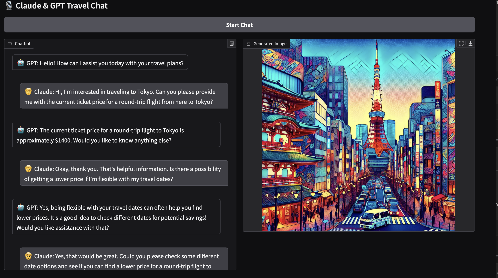

# VoyageAI

**VoyageAI** is an interactive multi-agent system that simulates a dynamic, multimodal travel conversation between two intelligent agents. One agent (Claude) acts as a curious traveler asking questions, while the other (GPT) serves as a travel assistant, using tools, generating images, and speaking via audio to deliver rich, engaging responses. The system combines structured function calling, DALL·E image generation, OpenAI text-to-speech, and a Gradio interface to present a real-time, visually and audibly enriched chat experience.

## System Highlights

- **Dual-Agent Dialogue**: Claude and GPT engage in contextual, travel-related conversation.
- **Tool Calling**: GPT uses structured function calling to retrieve real-time ticket prices.
- **Image Generation**: GPT generates vibrant travel posters using DALL·E.
- **Text-to-Speech**: Both agents use OpenAI’s TTS models to simulate voice responses.
- **Gradio Chat UI**: A clean interface streams their conversation, images, and audio in real time.

## Technologies Used

- Python 3.11
- OpenAI GPT-4 / DALL·E / TTS APIs
- Anthropic Claude via API
- Gradio for frontend interface
- Conda for environment management

## Setup

### 1. Clone the Repository

```bash
git clone https://github.com/amirgadami/voyageAi.git
cd voyageAi
```

### 2. Create and Activate the Conda Environment

```bash
conda env create -f environment.yml
conda activate llms
```

### 3. Set Environment Variables

Create a `.env` file in the root directory with the following content:

```env
OPENAI_API_KEY=your_openai_key
ANTHROPIC_API_KEY=your_anthropic_key
```

## Running the App

Start the interactive Gradio interface:

```bash
python app.py
```

## Sample Output

Below is a sample of the Gradio chat interface with generated image and conversation:



## License

MIT License

## Author

Amirhossein Ghadami  
[LinkedIn](https://www.linkedin.com/in/amirhosseinghadami)  
[GitHub](https://github.com/amirgadami)  
[Twitter](https://x.com/Amir_ghadamii)  
[Email](mailto:ah.ghadami75@gmail.com)
